

# Bitscoper CV

Object Classification, Object Detection, Object Segmentation, Pose Detection / Landmarking, Hand Landmarking, Face Landmarking, Background Removal, etc.

## Ultralytics YOLOv8 Basics

Object Detection, Object Segmentation, and Pose Detection with Tracking Using the Official Models of Ultralytics YOLOv8.

### Object Detection

<table>
  <tbody>
    <tr>
      <td>
        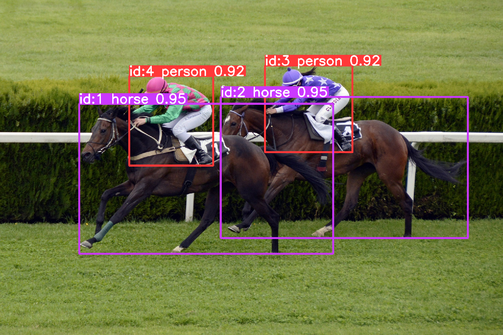
      </td>
      <td>
        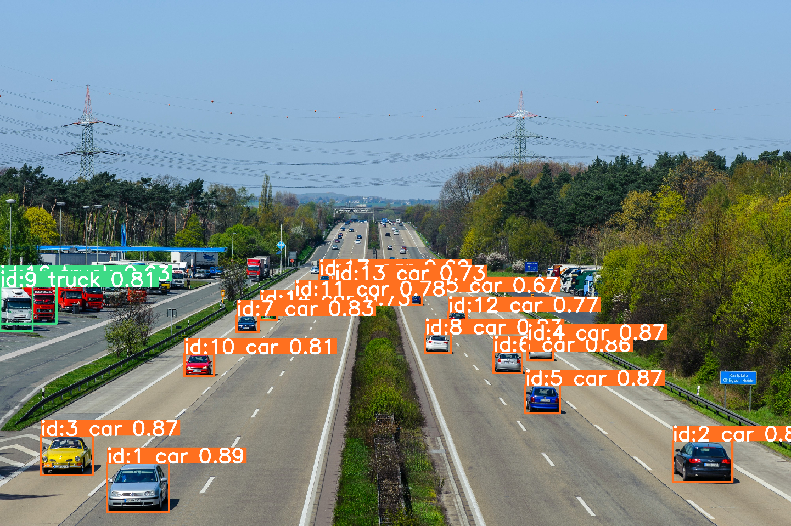
      </td>
    </tr>
  </tbody>
</table>

### Object Segmentation

<table>
  <tbody>
    <tr>
      <td>
        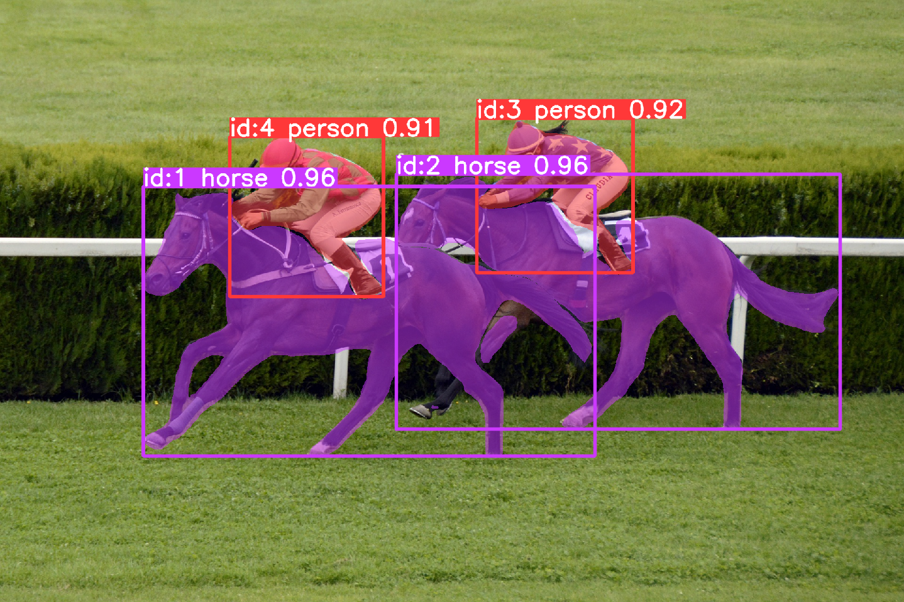
      </td>
      <td>
        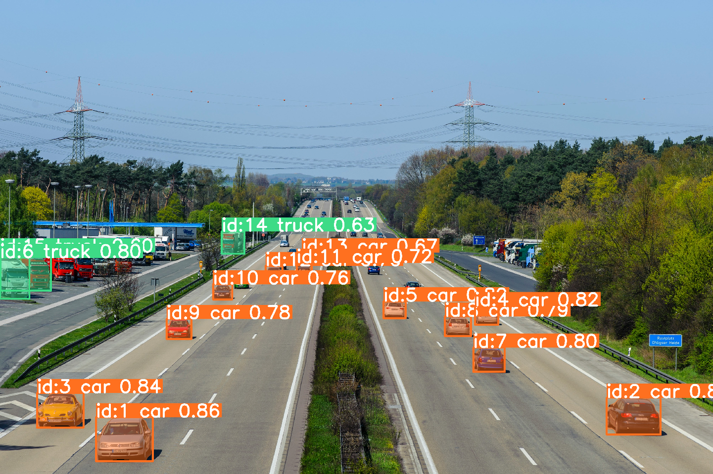
      </td>
    </tr>
  </tbody>
</table>

### Pose Detection

<table>
  <tbody>
    <tr>
      <td>
        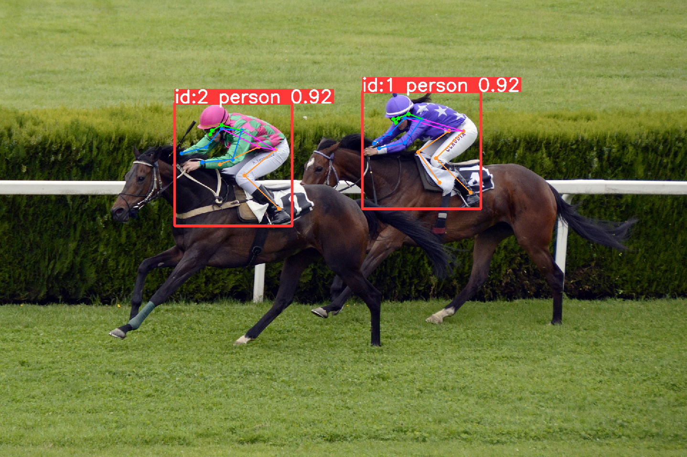
      </td>
      <td>
        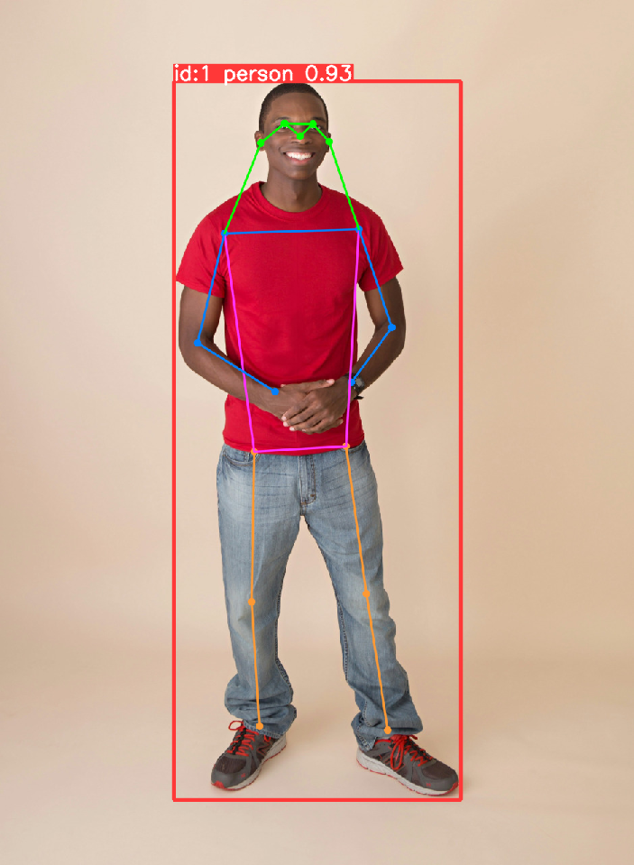
      </td>
    </tr>
  </tbody>
</table>

## Google MediaPipe Hands

Hand Landmarking using Google MediaPipe Hands.

<table>
  <tbody>
    <tr>
      <td>
        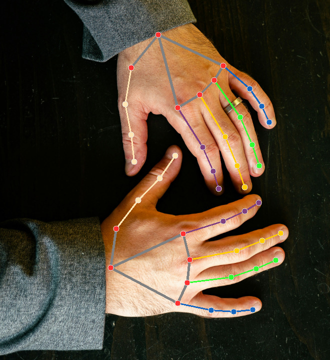
      </td>
      <td>
        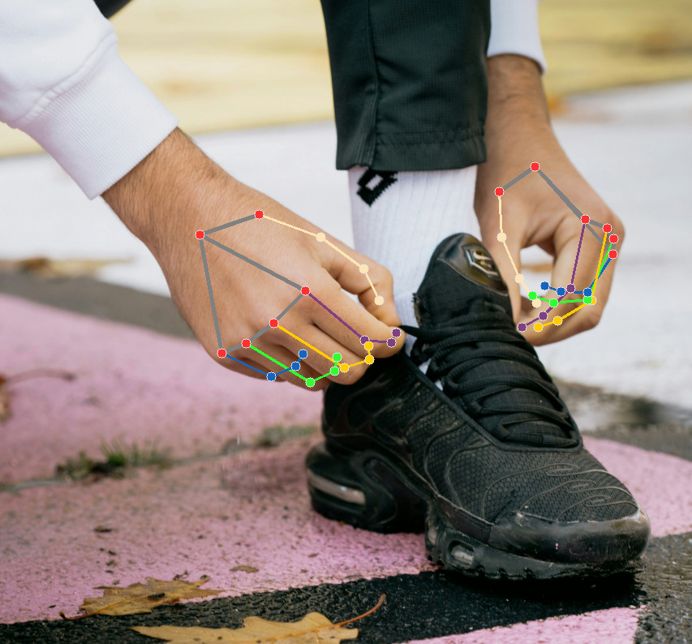
      </td>
    </tr>
  </tbody>
</table>

## Google MediaPipe Face Mesh

Face Landmarking using Google MediaPipe Face Mesh.

<table>
  <tbody>
    <tr>
      <td>
        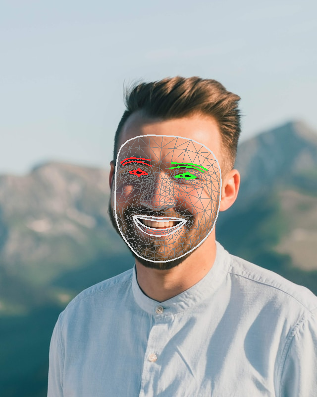
      </td>
      <td>
        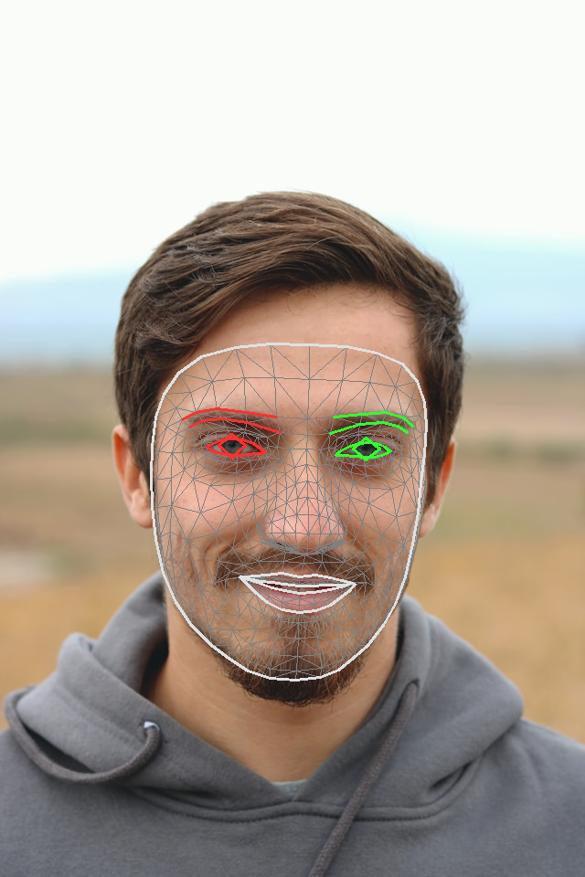
      </td>
    </tr>
  </tbody>
</table>

## Google MediaPipe Pose

Pose Landmarking using Google MediaPipe Pose.

<table>
  <tbody>
    <tr>
      <td>
        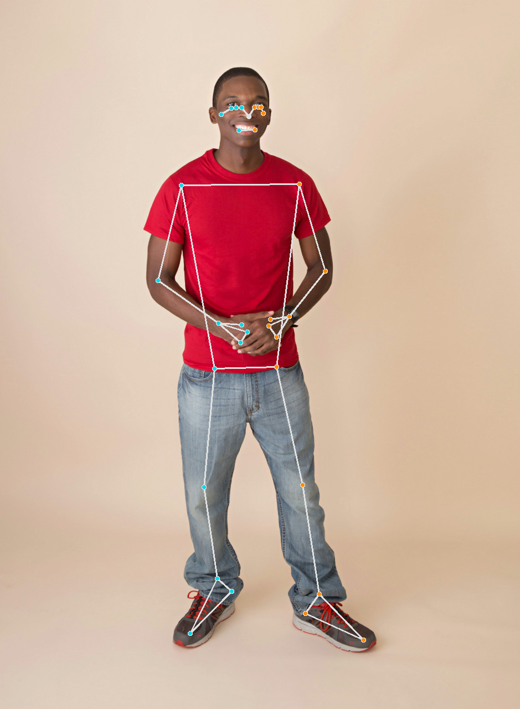
      </td>
      <td>
        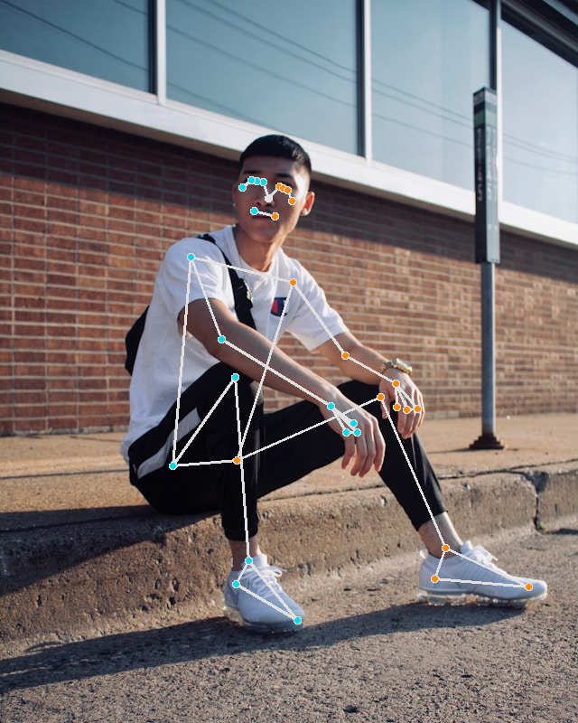
      </td>
    </tr>
  </tbody>
</table>

## Google MediaPipe Face Detection

Google MediaPipe Face Detection.

<table>
  <tbody>
    <tr>
      <td>
        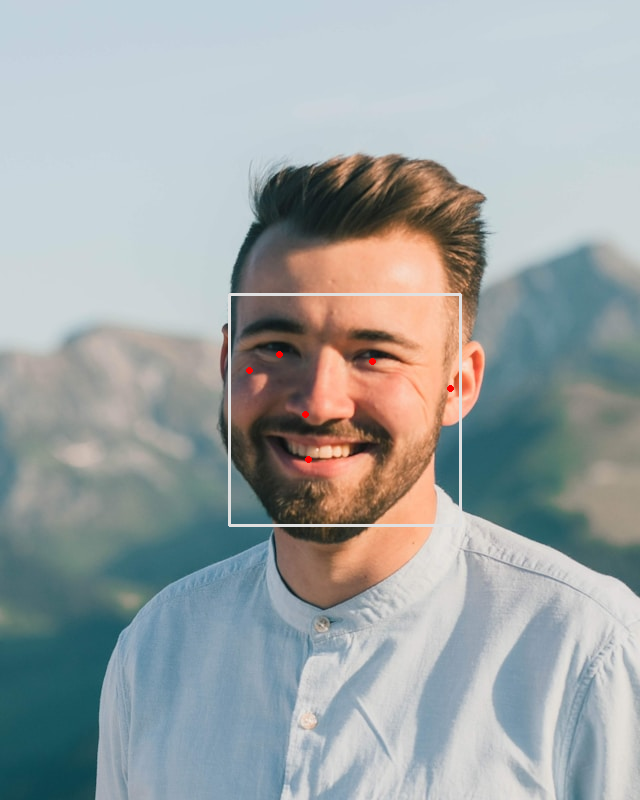
      </td>
      <td>
        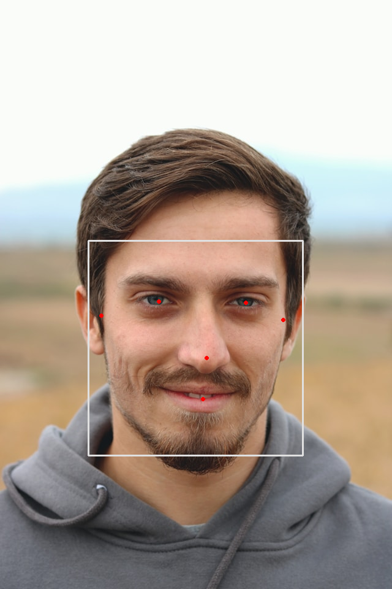
      </td>
    </tr>
  </tbody>
</table>
